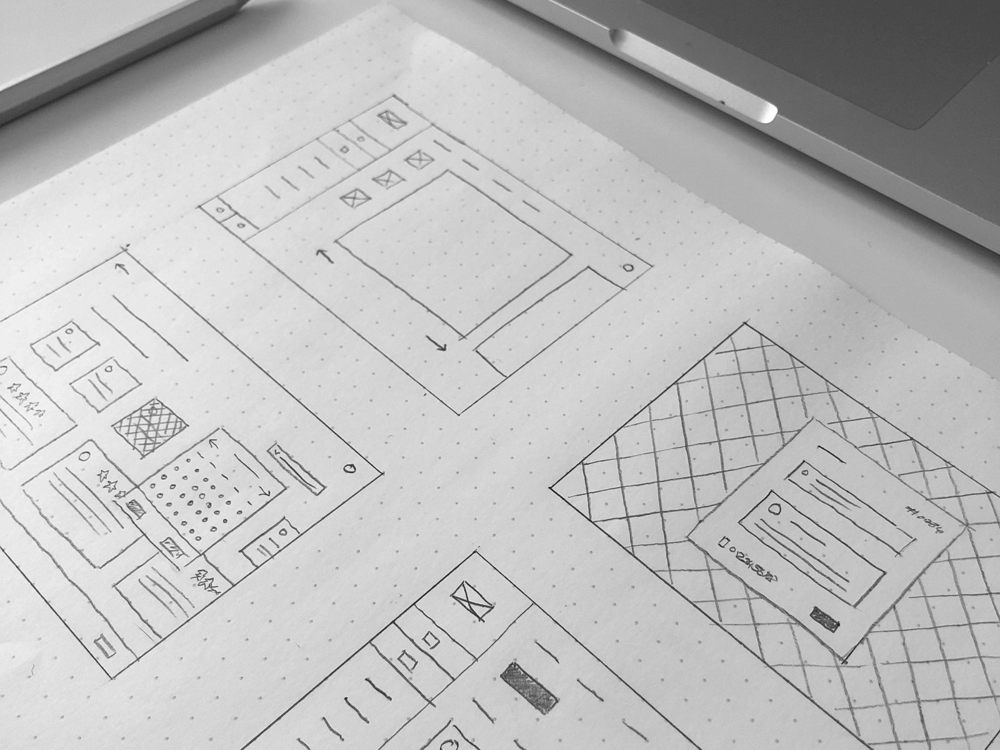
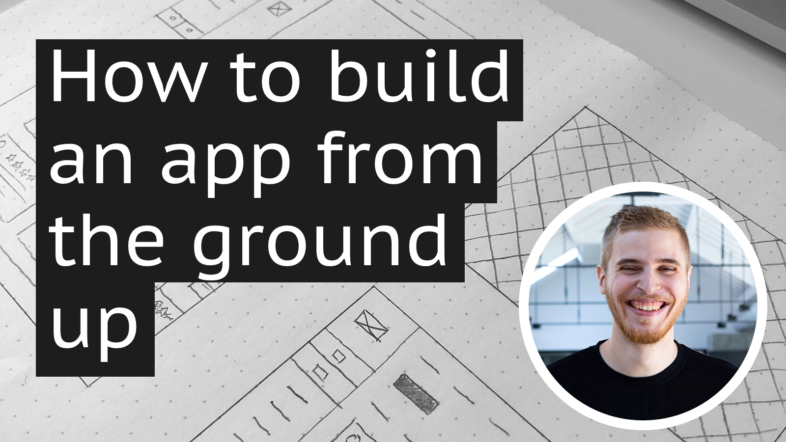
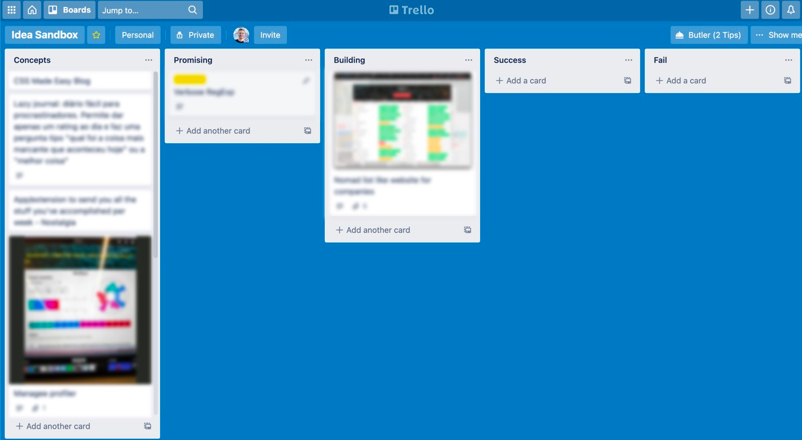
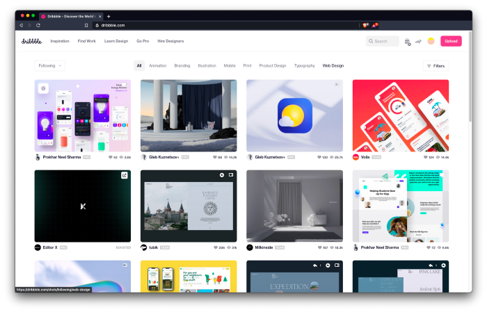
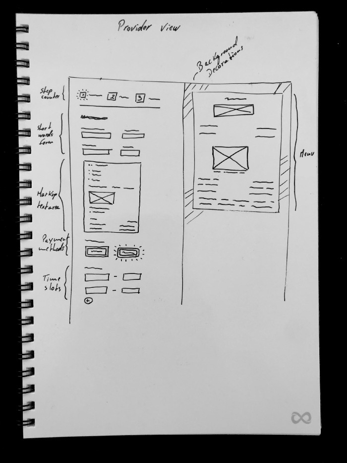
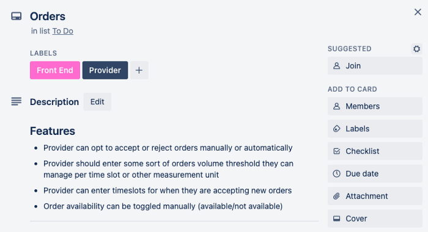
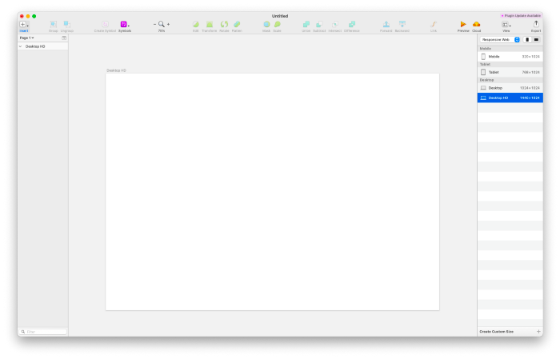
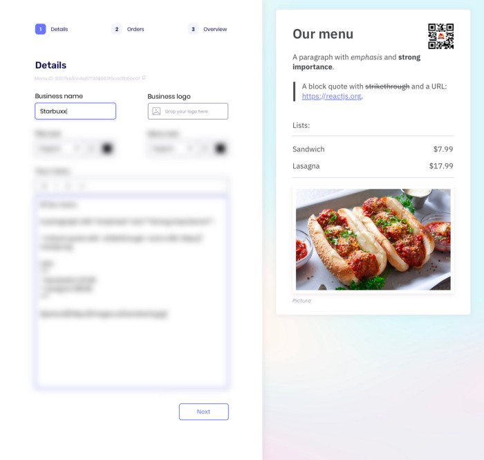

I started my web development career with no college degree, no clients and just studying at home by myself. Because of this I went through a lot of trial and error in order to figure out what I truly enjoyed doing and what exactly I was good at.

Most times I had an idea for a project (or side project) I had to rely only on my skills or develop new ones. Today I’ll be sharing how I build a web app from the ground up. From inspiration to idea, from mockup to development. Let’s get started!

If you’d rather listening instead of reading, I also made a video you can watch here:

## Log all your ideas (even the bad ones)

Every once in a while, when I'm feeling more in-tune, I get a bunch of ideas for apps or websites. To be honest, most ideas are either incomplete, impractical, way too complex or simply straight out bad. I try recording most of them somewhere I can take a second look later on kinda like a bucket of ideas or a suggestion box and I just let them sit there for a while. This could be a [Trello](https://trello.com/) board, a physical notebook or (my personal favourite) a [Notion](https://www.notion.so/) document.

If the idea sticks with me for a bit, I take note of everything that comes to mind that could be part of it: the concept, the features, the problems it would solve, etc. Then I put it down and go about my day.

A few years ago I read that someone would place their ideas into different columns representing their “likeliness to succeed”. All ideas would start in a generic column (let’s say it’s called the “**backlog**” column), advance to “**promising**” if it started to sound good and move on to “**in progress**” if it was worth the shot. Finally, after its execution the idea would end up either in the “**success**” or the “**failure**” column.

This is because any idea can be useful even if it alone provides little value. The idea of today can be turned into a simple feature of a better idea of tomorrow. A complete failed project can provide valuable insights for future good ideas such as “Why did this fail?”. Keeping an archive of every explored idea can serve both as inspiration, proof of concept or simply a reminder of what (not) to do.

_Ideas trello board_

If, after a couple of days, I notice my brain is still thinking about the same idea and about how it could be improved I move it to the “promising” column and I start looking into similar products out there to try understanding whether or not this could be a viable solution. If I find similar projects out there (aka competition) I try figuring out how mine would differ or even improve on the concept. Remember: **competition often means there is a validated market for your idea.**

What I do next is to **write down a pitch**. You know, like I’m going on shark tank to sell a business. I write down **who** the idea is for (my target demographic); **why** it makes a difference (why the users would want this app); and **how** it would work (the features/logic it would have).

I don’t actually go on shark tank with the pitch but this will come in handy whenever I want to present others with my concept or even for myself if I end up losing focus or sense of purpose down the line (which happens occasionally). I often tell a couple of friends about my ideas and they give me advice on how to improve it, how to implement it or simply tell me about other similar products they’ve come across.

Word of advice: sometimes **your friends can make or break your motivation** with their feedback but keep in mind that they’re just one person with one opinion so their support or disapproval doesn’t mean your idea will either be a failure or a success.

Once I’m excited enough to move the idea to the “promising” column I move on to the next step: designing!

## Design

### Wireframing

I use Sketch as my design tool of choice but I don’t usually know exactly what I’m gonna do when I open a blank canvas.

Like I said before: I’m a developer by trait, not a designer. But sometimes in order to make ends meet you gotta step outside your comfort zone and do whatever’s necessary.

My go to inspiration source for all things “app design” related is [dribbble.com](https://dribbble.com/).

_homepage of [dribbble.com](http://dribbble.com/)_

I search up for projects within the same category as my idea (ie. “cooking app”, “interior design app”, “music app”, etc.) and try to imagine a base layout that would fit my hypothetical app.

Will it have a main navigation at the top of the homepage? Will it have a hero banner with some illustration on it? How much text vs white space is it gonna display? Do I want to start with the homepage page or with the app itself?

As I browse for inspiration, I get a physical notepad so I can start wireframing the base layout.

_Hand drawn wireframe in a notebook_

I’m using an “[infinite book](https://en.infinitebook.com/)” which allows me to erase the marker ink and reuse the pages. It’s also pretty good to just erase mistakes as I draw.

Next up we do a bit of project management.

### Features lists

Now that I have a vague idea where some things will be placed on the screen, I write down all the features I want to be done. I try to be as specific as I possibly can. What the feature consists of; all it’s nuances; possible challenges and sometimes even implementation details.

_Example of a trello feature card_

In each feature card I add screenshots to serve as reference, add labels with some categories such as “Front end”, “Back end” or “Design”.

All of this will guide me in the future when I need to imagine how it will look like and it will also help me keep track of the work yet to be done or prioritised.

Now that I have some visual idea of what to build, it’s time to put this into pixels and give it some colour and shape.

### Designing on a canvas

I start by creating a 1440px wide artboard. This is where our desktop version of the page will be laid out.

_The frightening blank canvas 😱_

Now we have to figure out how our UI is going to look like. To come up with base style I like, I browse Dribbble for more specific UI elements (ie. “app navigation”, “web app button”, “color scheme”, “UI kit”, “web section”, “app form”). I save a bunch of UI posts I like and once I have a decent amount it’s time to cherry pick the details I like from them to come up with my own. I used to not know how much was enough when it comes with UI ideas I liked and ended up saving too many which would lead me to feel overwhelmed when the time to choose came. So now I try sticking to 3–5 examples per UI element before moving on.

After choosing a color theme and the base UI style I try finding the most appropriate font for the project. This may sound simple but it can be just as overwhelming as choosing the rest of the app elements. The fonts you choose will be part of the app’s character and what kind of personality I want to convey. Do I want to go with more formal look? Maybe a more classic serif font will work. Will it feature big titles in front of graphics? Perhaps a strong, flashy font for titles and a more readable one for bigger chunks of text.

Honestly I almost never feel very inspired for this task so I end up just looking up something like “best free web fonts 20XX” or just browse some google fonts (google.com/fonts) if I want to keep things easy.

_Finalised page mockup_

Now that we have a first page that will serve as the foundation for our UI I usually change gear and switch to what I enjoy the most: the programming!

## The code

I’m a visual thinker. I like having visual clues and indications of what I’m about to work on. That’s why I design my own mockups instead of jumping head first into the development side of the work. However my biggest passion is the code implementation part. Because of that, instead of doing the whole design process upfront, I jump between designing and programming as I work on my projects. Once I’m done designing a page, I program it. I try different things while I’m at it, like adding some animations or do mobile/tablet adjustments on the spot. This helps me avoid getting bored in any phase of the project or worse: burned out 🔥

If I’m building something with relatively complex logic I use React and to setup my projects I use `[create react app](https://create-react-app.dev/)` so I can focus on the product instead of worrying about tools and the initial project boilerplate. This way everything is automatically set up for me and I can get started right away.

I start with the `App` component (as it is usually the main container of the react app) and, from there, I follow the mockups' specs page by page, section by section.

After some time programming I eventually run out of finished mockups and have to jump back to designing new pages and the cycle repeats itself until I have a finished product. If I have to do my own back-end programming (which I dread) I simply include it in the process as another step in the cycle.

## Final thoughts

I start a lot of side projects and, truth is, I don’t finish nearly as much projects as the ones I start. Finishing projects is great not only because it can make you feel closure and sense of accomplishment for getting it done but also, in the end, you have something to show off in your portfolio. And who knows, you might even be able to monitize it if you want.

In spite of that, I always encourage people to start new projects not just because of the end result but because of all the experience the process will bring you. You will be forced to learn things you never used before in order to get everything done; you will have to practice self discipline and critical thinking to make sure the project doesn’t go off rails (or to avoid procrastinating); you have make judgement calls regarding what can be done, what might be too ambitious and what simply just won’t work; and last but not least, this is how you practice, practice, practice.

Hopefully this can get you motivated to expand your limits to what you think you can do and try new things outside your comfort zone in order to turn your ideas into reality. Have fun!
