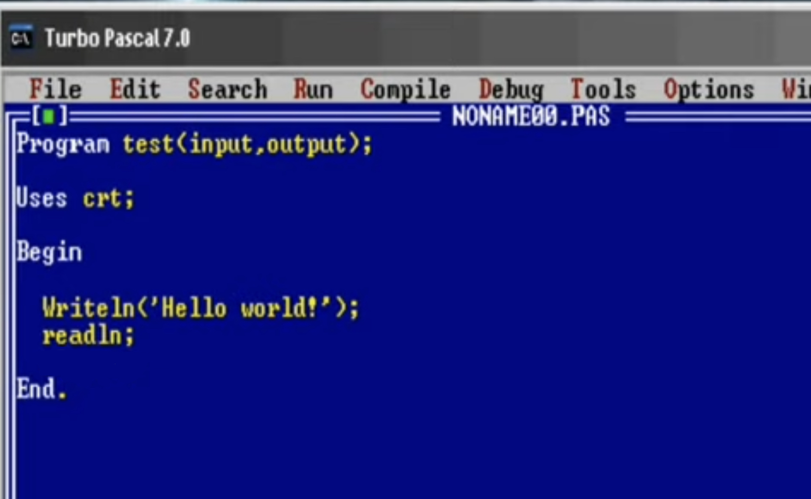
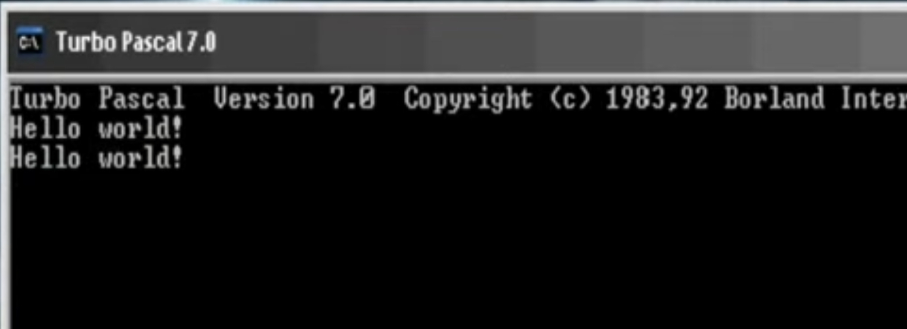
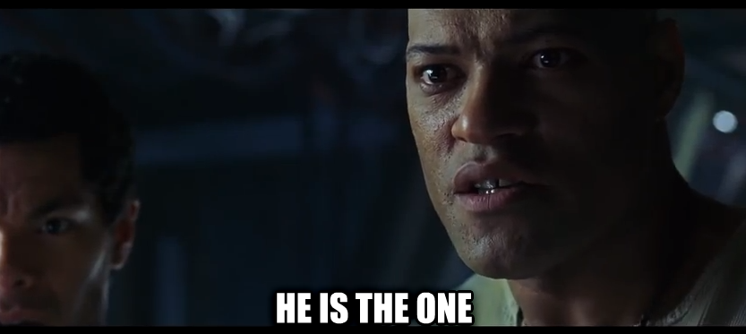
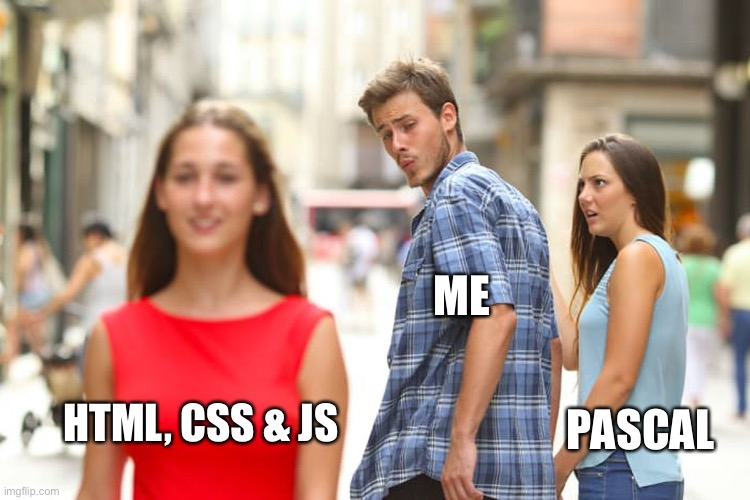
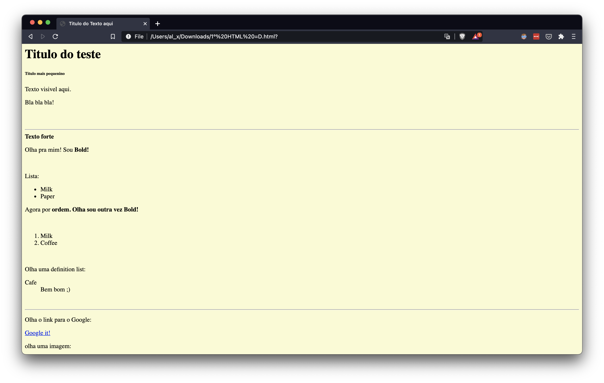
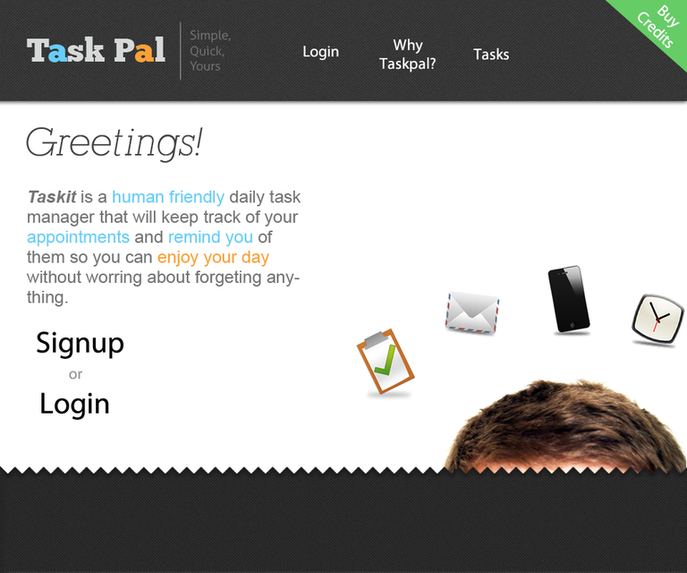
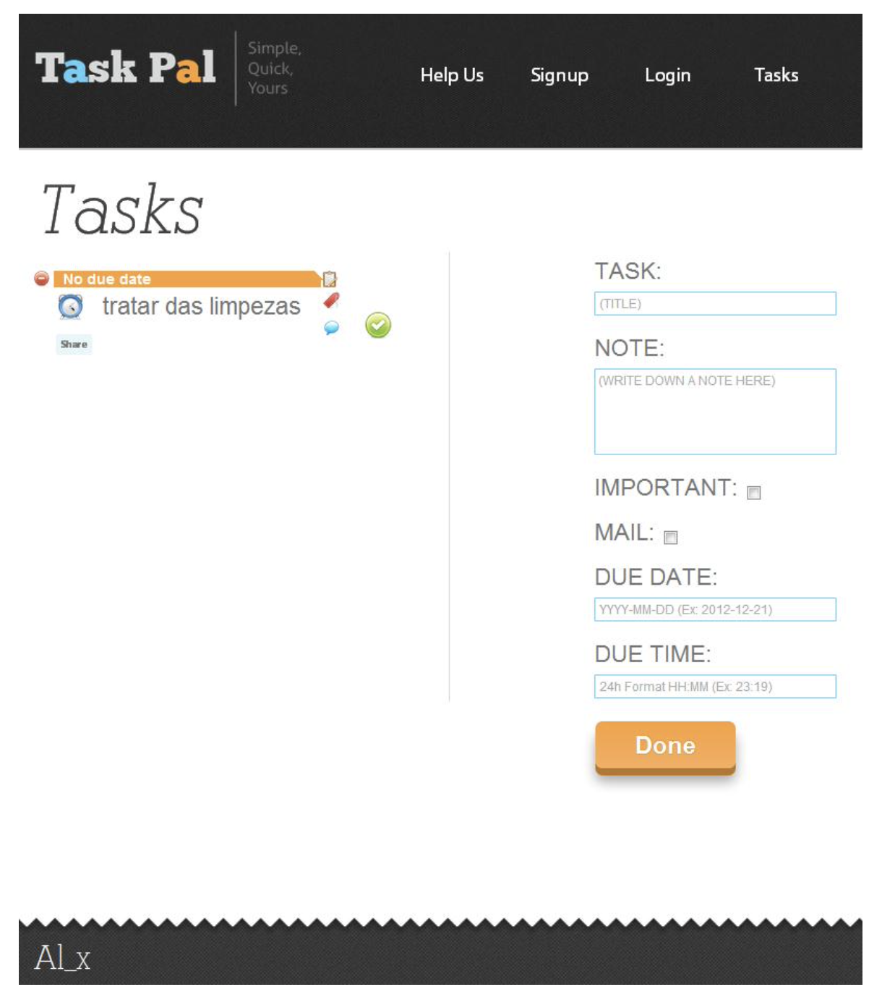
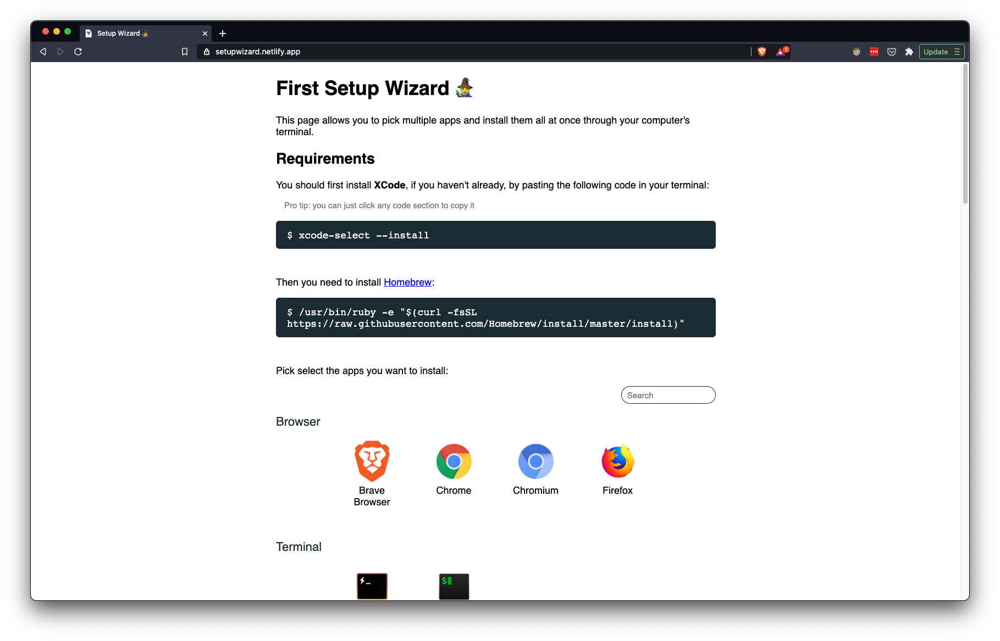

This is gonna be a short series where I share what I went through throughout my professional career to become the professional developer I am today. From unemployed to a self taught developer working at two unicorn companies and now working in a senior role at a startup.

I hope you can get a feel of what might be in store for you if you’re in the initial phase of your own career path or that you can at least realize that, in spite of the ups and downs, things can turn out alright as long as you don't give up on your passion 💪

## Background intro

I played video games ever since i was a kid and yet it was only when I was around high school that I realised there are people writing code running in the background of my games and all the software we use daily.

Because of my interest in computers, a friend of mine suggested I'd try a programming course in high school. I loved video games but I couldn't imagine myself in a 9 to 5 job "working in IT". I guess in my head this meant sitting at a desk, looking at the insides of a computer and try to fix whatever the reason was for it to be booting up into a blue screen, which sounded dreadful to me at the time... Even though I was skeptical regarding my long term interest in following a career path around computers I took the chance.

## The very first steps into coding

During the course I had my first ever interaction with code with a programming language called Pascal.

It wasn't much, I know. Heck, it was just an unimpressive terminal with a white cursor blinking on the screen. But I'd seen too many hacker movies at that point to know that exciting stuff can happen on a computer console.

The first time I coded basic math for it to return the result of a sum of 2 values I felt like I was hacking into the mainframe. And once I made an "app" that prompted the user for their name and returned "Hello <user's name>!" I knew I was one with the Matrix 😎

As I continued learning the basics of programming (arrays, functions, etc), and things began to make sense, I started adding more logic and more complexity to my code. Keep in mind that at this point the complexity I'm describing would be something like asking the user for multiple inputs, processing them and finally present them back. But this was already pretty cool for a noob such as myself!

The feeling of getting the user to trigger an action which had a reaction that I'd anticipated and prepared for was thrilling! It felt like a puzzle video game where I was given bits and pieces but had to place them together in order to progress and get my reward.

I remember going home and picking up where the last class had left off just because I wanted to see where the rabbit whole ended. Best part was it didn't! Turns out programming is not so much as a puzzle game as it is a sandbox: it only ends when you want it to.

## Homework

A few months past and I already had a pretty good grasp on the basics. At that point Mr. Pascal was no longer enough. I needed someone new, someone fresh and I was ready to go out there and have a taste of what the world has to offer.

I asked my friend who got me in this mess what I should be learning in order to make something actually usable and productive. He was like "Have you met HTML? Maybe you should look into that. And CSS. Oh and JavaScript while you're at it. Could also try PHP if you want."

Now, if you're a beginner I'm sure you've heard these exact words as well (maybe not the PHP part, PHP was more popular _back in my day 👴_). And though it might sound like a lot, it all connects together fairly well.

### Anatomy of the web

Whenever I have to explain what HTML, CSS and JS are to “non tech people” and why they're so intertwined - even though they are different languages - I provide a human body analogy to help visualise their purpose:

💀 **HTML**: This is our page's skeleton. It's the backbone of the web. If everything else falls apart, we can still see the bones of a page and have some sense of what it is trying to accomplish.

💅 **CSS**: Ahh the pretty side of any web page. This would be the skin covering our cold, ugly bones. Any skeleton looks a lot friendlier with some skin and some make-up if we want to get fancy.

🧠 **JavaScript**: JS is the brains of the whole operation. Sure the page is there, standing on its two feet, smooth, pretty and ready to charm anyone that comes by. But how can we greet our visitors without a brain? If we want to understand our tenants we probably should try and get to know them a bit, maybe ask them to fill a newsletter, or even login. That's where the big brain logic comes in.

_My first ever web page where I showed off a bunch of HTML tags. I was pretty damn excited about it 🚀_

## The First "Big Step"

At the end of my programming course, I had to consolidate everything I'd learn into a final project.

Being the original waterfall of creativity I naturally am, I decided to made a note taking app 😎

It wasn't just about taking notes though, no no no! It had a strong focus on scheduling tasks and notifications for your notes. At the time notifications didn't get the hate they do today…

_I thought adding myself to the homepage would make me look pretty cool_

_TaskPal in its glory days_

Since I didn't know how to develop on mobile devices I couldn't do push notifications on phones. I could send a browser notification but then I'd run the chance of TaskPal telling someone they should have left for the airport 6 hours ago because they hadn't stopped to sit in front of a computer, opened their browser and checked the TaskPal app.

This limitation made me look for alternative solutions. Eventually I found a few APIs that would allow me to send an email or an SMS automatically with a custom message. It was far from a great user experience but got the job done.

_TaskPal email notification_

This took **months** of research and development. I had to learn **HTML** for the page structure; **CSS** for its styling; **SQL** (database language) to manage users; **PHP** to handle the logic of communicating with the front-end, the database and the notification APIs; **Photoshop** for some graphics and icons; how to integrate the notification APIs and **JSON** to read data from them.

This was a **lot** at the time but In the end I was able to complete the project and got 19 points out of 20. I didn't end up putting the project on the web. I dropped the project a little after that and that was it for TaskPal 🪦

## The world was my oyster

Now that I knew what I wanted to do professionally, I was ready for a new chapter.

Where I'm from, most people assume college is the step right after high school. I was never a big fan of this idea of college being a "must have" in order to have a decent job. Specially in my case where I knew exactly what I wanted to do and had all the tools required to learn it: a computer and internet connection.

A few people around me insisted I'd go to college anyway so I gave it a shot. I didn't want to go for computer science because I knew there was a lot of filler that I wasn't gonna put into use as a web developer (like network systems, advanced calculus, etc) so I opted for a more "multimedia" focused course which also included web development.

I got in and after a few months of amazing my colleges with my big brain who already knew a few basic html tags I realised that course wasn't gonna teach me anything I didn't already know. So I dropped out after one semester 😅

I went back to my mother's house - fortunately she was able to support me for a few months - and I decided to study at home and eventually apply for a job.

I wasn't really sure where to start. I’d never had to look for job. I didn’t even know what people excepted from me as a developer. So I looked up vague terms like "front end developer job" and filtered it for results in my country. By looking up what the market was looking for I was able to learn which technologies were valuable, which skills I still had to develop, what companies were out there, how much they were offering, etc.

I soon realised that I should probably focus my studies more on JavaScript - since it was so requested and it was also something I had a basic understanding of and enjoyed - and into this framework called AngularJS.

Now that I had new goals everything was new again. There was so much I didn't know, so much I didn't understand and almost no one to resort to for answers. I was no longer in school, I'd dropped out and now I had to make this work in order to get the job I wanted. The stakes were higher than ever.

## Self promotion

I was never a very good student when it comes to just sit and read what I had to learn. I've always felt the need to put things into practice. That's how I learn, how I understand how things work, their purpose, their advantages and limitations. So whenever I had something new and big to learn (either a new language or new framework) I built side projects.

When I learned HTML I made web forms; when I learned php and sql I made TaskPal; when I learned Vue I made a small setup wizard app to help people speed up the process of installing their productivity apps - whenever they get a new computer - as quickly as possible.

These weren’t brilliant ideas but they all helped me put a purpose into what I've learned and some of them ended up being useful for my personal use.

Now, why am I telling you this? Because looking at so many job ads made me realise something: I had nothing to show off at a job interview. I didn’t have a college degree nor any sort of “clients testimonies” to help me land my first job ever! I knew how to program so could I prove this to a potential employer? I figured I had to build a portfolio. If I couldn’t show grades or a certificate that vouched for me, I had to show actual work that could.

I wasn't bold enough nor I had a strong entrepreneur vein to start charging people for my unskilled services but I started asking around for ideas. (Un)Surprisingly asking "What kind of web app would make your life easier?" is not something most people can easily answer quickly on the spot.

So I started with myself: I'm a front end developer. I should at least practice what I preach. So I designed an online page about me so I could at least have a professional presence online.

After that I asked a developer friend of mine whether he had any pending projects or people who he knew that were looking for a website and I would do it _pro bono_. Most of them weren’t pretty, some didn’t go beyond the mock-up design phase and other projects didn’t even see the light of day. But in the end I had something to show for.

## Cliff hanger

With a personal page up online and some projects under my belt, I was ready! I wasn't confident (confidence was never really my strong suit to be honest) but I knew I had something concrete to present at a possible interview.

Throughout the years I applied to dozens of job ads, dozens of interviews and a **lot** of rejections. I never really got used to job interviews as I always get nervous, stutter and sometimes even sabotage myself but I learned a lot with them: how to prepare **a resume**, how to prepare for an **interview**, how to **talk** to someone who knows a lot more than you, how to handle a **rejection** and how to **negotiate** an offer.

But more on that later 😉

Thanks for reading!

More to come soon™
