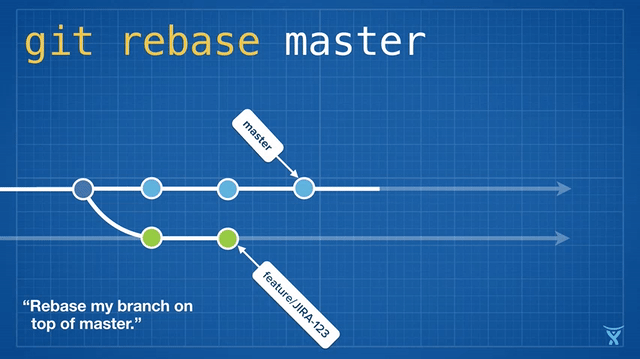
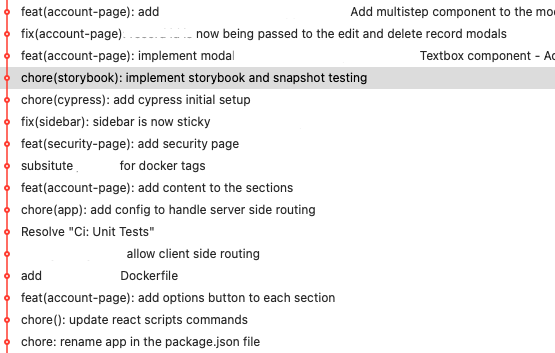
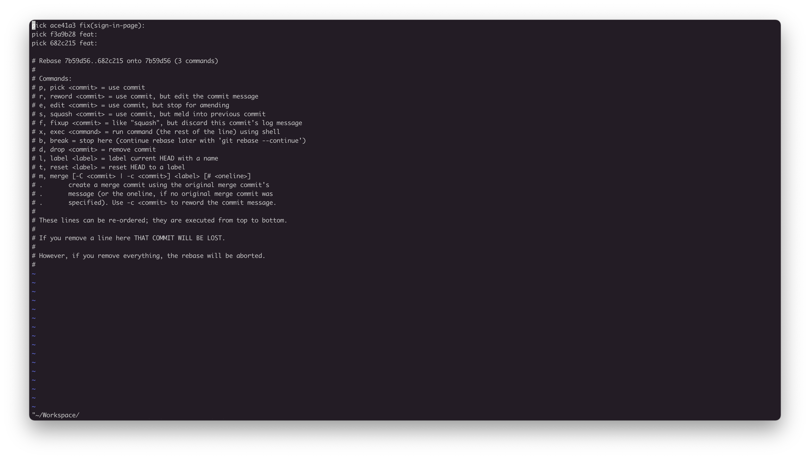
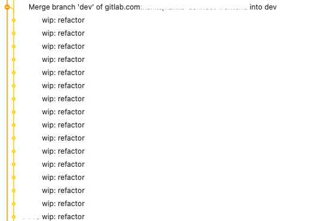
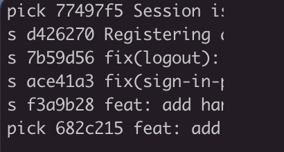
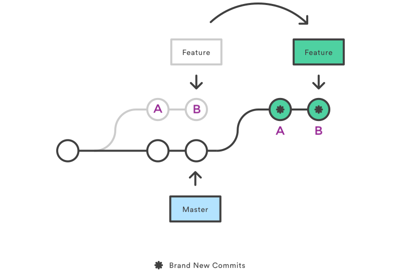
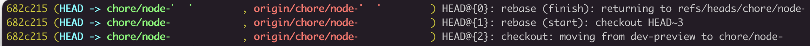

## What is a rebase? 📚

Rebasing is one of the two Git process of integrating changes from one branch to another.

While `merging` always moves a branch forward in history by simply adding a new commit representing each branch integration, `rebasing` can be much more powerful (and dangerous) as it allows us to rewrite history.


## Why do we rebase? 🧐

Rebasing is the process of `moving` or `combining`(i.e. squashing) a **sequence of commits** to a new base commit.

Imagine you're working on a feature branch and after sometime you realise the `main` (aka "master") branch has been updated by someone else's code. This means your branch has now diverged from the `main` branch. At some point you will want to include said changes in your feature branch. A common way of doing this would be to simply do a `git pull` from `main` which would add a _merge commit_ to your feature branch.

The issues with this method can be:

- `Merge commits` can be very vague, providing very little information in the git tree which makes debugging a much harder task
- Updating a branch - by `pulling`/`merging` - multiple times can result in a git history similar to this:

  

  Reading this history provides very little (if any) information on what changes have been made to the project

The goal of rebasing is to keep a clean, clear project history. So instead of pulling the `main` changes and add a merge commit we can tell our branch to move its commits to the top of the latest changes



Feature branch _JIRA-123_ is being rebased to the top of the master branch

By rebasing our feature branch to the top of the `main` branch, we keep all the changes and commits we made unaltered while getting the latest main `updates`. In order to achieve this we can execute the following command **while in our feature branch**:

```
$ git rebase main
```

This will start the rebase process. If no conflicts are found you should see a success message and your feature branch is now up-to-date with the `main` branch and we're one step closer to having a project history similar to this:



## Interactive rebase 🔬

Interactive rebasing brings the power of rebasing to a whole new level! It allows us to interactively change multiple commits in different ways.

You can start an interactive rebase by executing a rebase command followed by the `-i` parameter and the commit we want to modify:

```
$ git rebase -i <commit hash | HEAD position>
```



Interactive rebase CLI showing the three last commits and always in order from oldest (top) to newest (bottom)

We can tell just by looking at list of commands displayed in the CLI how powerful this tool can be! We can edit commits, squash them, remove them, amend them and so much more. We can even permanently change the commit order!

### Squashing

`Squashing` allows us to specify which commits we want to combine in order to help maintain clean history.

Does something like this look familiar?



Well, if you like committing a lot while you work you probably don't like thinking about being super descriptive on every single commit message. Squashing can be extremely helpful in these situations because starting an interactive rebase you can then tell git which commits will be "merged" into one (or more) and then edit its commit message.

Keep in mind that we must always squash a commit "into" another one.

So say we have 6 commits and we think only two of them are relevant we could squash the other 4 like:

```
$ git rebase -i HEAD~6
```



"s" is simply a shorthand name for "squash"

In this case we're saying we'd like to merge commits 2 - 5 and include them in the first one (`77497f5`) and keep the last commit as is.

Next git will rebase each commit to their new base (`77497f5`) and if there are no conflicts, you'll be able to change their final commit messages and voila! Only 2 commits total!

## What could go wrong? 😇

### Conflicts

Similarly to what happens with a `git merge`, updating a branch with another can result in code conflicts.

A big difference of rebase conflicts is that we're not dealing with one `merge commit` but with (possibly) multiple commits being moved.

This means rebase conflict solving is an iterative process that goes through each commit being rebased.



In a feature branch with two commits, if a conflict is found while rebasing _commit A_ we fix it, tell git to continue the process to the next commit, fix the new conflicts on _commit B_ \*\*\*\*and only then we'll be done

### Pushing local branch after rebasing

Rebasing a local feature branch means **we're rewriting history**, so what this actually means is that we're not cherry picking the feature branch commits to the new base. Although visually everything looks the same Git creates new commits (with new hashes) on the targeted branch.

This means whenever we try simply pushing our changes to our remote repo we get an error stating the local and remote branches have diverged.

To fix this problem it's good practice to `push` using the `—-force-with-lease` parameter.

You can check [—force vs —force with lease](https://blog.developer.atlassian.com/force-with-lease/) to learn more about this.

### "I think I made a mistake"

Have you heard of the beautiful command:

```
$ git reflog
```

`Reflog` allows us to check every change we did to our local branch. Running the command will return something like this:



Reflog output showing the last 3 actions

In this case if I'd like to go back before I ever did the rebase I could jump back to `HEAD~2` or using its hash instead:

```
$ git checkout 682c215
```

At this point I'm are in the past and can undo the mistakes I'd made before. Time travel!! 🏎🔥

### If things get out of control

At any point in our interactive rebase if things get too messy and we no longer know how to fix them, we can always abort the whole process in the terminal and the interactive rebase will be canceled completely:

```
$ git rebase --abort
```

## Conclusion

As you can tell rebase can be used for a lot of different purposes, especially using the interactive rebase functionality. Hopefully this article provides you with just enough to get started messing around with it.

Don't worry if you run into issues understanding some of the nuances of git rebase. It has its learning curve and that's why I included some escape methods so you can go back and try again 💪
